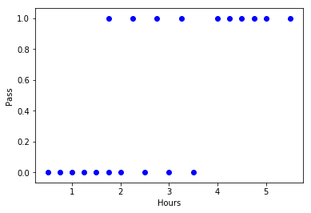

# LogisticRegression
逻辑回归

# 逻辑回归


```python
#建立数据集
examDic={
    '学习时间':[0.50,0.75,1.00,1.25,1.50,1.75,1.75,2.00,2.25,2.50,
            2.75,3.00,3.25,3.50,4.00,4.25,4.50,4.75,5.00,5.50],
    '通过考试':[0,0,0,0,0,0,1,0,1,0,1,0,1,0,1,1,1,1,1,1]    
}
```


```python
# 导入 OrderDict 包
from collections import OrderedDict
examOrderedDict=OrderedDict(examDic)
```


```python
#导入 pandas 包
import pandas as pd
examDf=pd.DataFrame(examOrderedDict)
```


```python
examDf.head()
```


<div>
<table border="1" class="dataframe">
  <thead>
    <tr style="text-align: right;">
      <th></th>
      <th>学习时间</th>
      <th>通过考试</th>
    </tr>
  </thead>
  <tbody>
    <tr>
      <th>0</th>
      <td>0.50</td>
      <td>0</td>
    </tr>
    <tr>
      <th>1</th>
      <td>0.75</td>
      <td>0</td>
    </tr>
    <tr>
      <th>2</th>
      <td>1.00</td>
      <td>0</td>
    </tr>
    <tr>
      <th>3</th>
      <td>1.25</td>
      <td>0</td>
    </tr>
    <tr>
      <th>4</th>
      <td>1.50</td>
      <td>0</td>
    </tr>
  </tbody>
</table>
</div>


## 提取特征值和标签


```python
#特征值 features
exam_X=examDf.loc[:,'学习时间']
#标签 labels
exam_Y=examDf.loc[:,'通过考试']
```

## 绘制散点图


```python
#导入 matplotlib 包
import matplotlib.pyplot as plt
plt.scatter(exam_X,exam_Y,color="blue",label="exam data")
#添加标签
plt.xlabel("Hours")
plt.ylabel("Pass")
#显示图向
plt.show()
```





## 建立训练数据集和测试数据集


```python
'''
train_test_split是交叉验证中常用的函数，功能是从样本中随机的按比例选取训练数据（train）和测试数据（test）
第一个参数：所要划分的样本特征
第2个参数：所要划分的样本标签
train_size：训练数据占比，如果是整数的话就是样本的数量
sklearn包0.8版本以后，需要将之前的sklearn.cross_validation 换成sklearn.model_selection
'''
#导入 train_test_split包
from sklearn.model_selection import train_test_split
#建立训练数据和测试数据
X_train,X_test,Y_train,Y_test=train_test_split(exam_X,exam_Y,train_size = .8)
#输出原始数据大小
print('原始数据特征：',exam_X.shape ,
      '，训练数据特征：', X_train.shape , 
      '，测试数据特征：',X_test.shape )

print('原始数据标签：',exam_Y.shape ,
      '训练数据标签：', Y_train.shape ,
      '测试数据标签：' ,Y_test.shape)
```

    原始数据特征： (20,) ，训练数据特征： (16,) ，测试数据特征： (4,)
    原始数据标签： (20,) 训练数据标签： (16,) 测试数据标签： (4,)
    

    D:\software\ANACONDA\lib\site-packages\sklearn\model_selection\_split.py:2026: FutureWarning: From version 0.21, test_size will always complement train_size unless both are specified.
      FutureWarning)
    


```python
#绘制散点图
plt.scatter(X_train,Y_train,color="blue",label="train data")
plt.scatter(X_test,Y_test,color="red",label="test data")
#添加标签
plt.xlabel("Hours")
plt.xlabel("Scores")
#显示散点图
plt.show()
```


## 训练模型


```python
#第1步：导入逻辑回归
from sklearn.linear_model import LogisticRegression
#第2步：创建模型
model = LogisticRegression()
#第3步：训练模型
#将训练数据特征转换成二维数组XX行*1列
X_train=X_train.values.reshape(-1,1)
#将测试数据特征转换成二维数组XX行*1列
X_test=X_test.values.reshape(-1,1)
model.fit(X_train , Y_train)
```


    LogisticRegression(C=1.0, class_weight=None, dual=False, fit_intercept=True,
              intercept_scaling=1, max_iter=100, multi_class='ovr', n_jobs=1,
              penalty='l2', random_state=None, solver='liblinear', tol=0.0001,
              verbose=0, warm_start=False)


## 评估模型


```python
#评估模型：准确率
model.score(X_test , Y_test)
```


    0.5


## 进一步理解什么是逻辑函数


```python
#获取概率值
#第1个值是标签为0的概率值，第2个值是标签为1的概率值
#model.predict_proba(3)
model.predict_proba(3)
```


    array([[ 0.41778163,  0.58221837]])


```python
#预测数据：使用模型的predict方法可以进行预测。这里我们输入学生的特征学习时间3小时，模型返回结果标签是1，表示预测该学生通过考试。
pred=model.predict([[3],[2],[1]])
print(pred)
```

    [1 0 0]
    


```python
'''
理解逻辑回归函数
斜率slope
截距intercept
'''
import numpy as np

#第1步：得到回归方程的z值
#回归方程：z=𝑎+𝑏x
#截距
a=model.intercept_
#回归系数
b=model.coef_

x=3
z=a+b*x

#第2步：将z值带入逻辑回归函数中，得到概率值
y_pred=1/(1+np.exp(-z))
print('预测的概率值：',y_pred)
```

    预测的概率值： [[ 0.58221837]]
    
